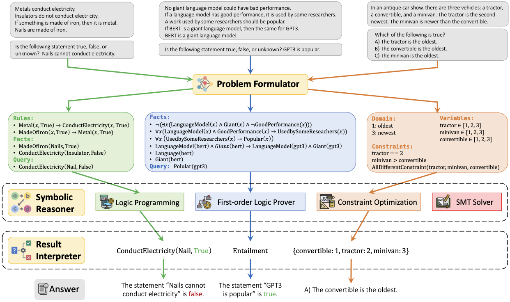

# Logic-LM
Codes for ["LOGIC-LM: Empowering Large Language Models with Symbolic Solvers for Faithful Logical Reasoning"](). 

Authors: **Liangming Pan, Alon Albalak, Xinyi Wang, William Yang Wang**. 

[NLP Group](http://nlp.cs.ucsb.edu/), University of California, Santa Barbara

## Introduction

This repository contains the code and data for the paper [LOGIC-LM: Empowering Large Language Models with Symbolic Solvers for Faithful Logical Reasoning](). We introduce a novel framework, **LOGIC-LM**, which integrates LLMs with symbolic reasoning to improve logical problem-solving. Our method first utilizes LLMs to translate a natural language problem into a symbolic formulation. Afterward, a deterministic symbolic solver performs inference on the formulated problem. We also introduce a self-refinement stage, which utilizes the symbolic solver’s error messages to revise symbolic formalizations. We demonstrate LOGIC-LM’s effectiveness on four logical reasoning datasets: ProofWriter, PrOntoQA, FOLIO, and LogicalDeduction. Our results show significant improvement compared to LLMs alone, with an average performance boost of 62.6% over standard prompting and 23.5% over chain-of-thought prompting. 



First, install all the required packages:

```bash
pip install -r requirements.txt
```

## Datasets

The datasets we used are preprocessed and stored in the `./data` folder. We evaluate on the following datasets:

- [ProntoQA](https://github.com/asaparov/prontoqa): Deductive resoning dataset. We use the 5-hop subset of the *fictional characters* version, consisting of 500 testing examples. 
- [ProofWriter](https://allenai.org/data/proofwriter): Deductive resoning dataset. We use the depth-5 subset of the OWA version. To reduce overall experimentation costs, we randomly sample 600 examples in the test set and ensure a balanced label distribution.
- [FOLIO](https://github.com/Yale-LILY/FOLIO): First-Order Logic reasoning dataset. We use the entire FOLIO test set for evaluation, consisting of 204 examples.
- [LogicalDeduction](https://github.com/google/BIG-bench/tree/main/bigbench/benchmark_tasks/logical_deduction): Constraint Satisfaction Problems (CSPs). We use the full test set consisting of 300 examples.

## Baselines

To replicate the **Standard-LM (Direct)** and the **Chain-of-Thought (CoT)** baselines, please run the following commands:

```bash
cd ./baselines
python gpt3_baseline.py \
    --api_key "Your OpenAI API Key" \
    --model_name "Model Name [text-davinci-003 | gpt-4]" \
    --dataset_name "Dataset Name [ProntoQA | ProofWriter | FOLIO | LogicalDeduction]" \
    --split dev \
    --mode "Baseline [Direct | CoT]" \
    --max_new_tokens "16 for Direct; 1024 for CoT" \
```

The results will be saved in `./baselines/results`. To evaluate the results, please run the following commands:

```bash
python evaluate.py \
    --dataset_name "Dataset Name [ProntoQA | ProofWriter | FOLIO | LogicalDeduction]" \
    --model_name "Model Name [text-davinci-003 | gpt-4]" \
    --split dev \
    --mode "Baseline [Direct | CoT]" \
```

## Logic Program Generation

To generate logic programs 